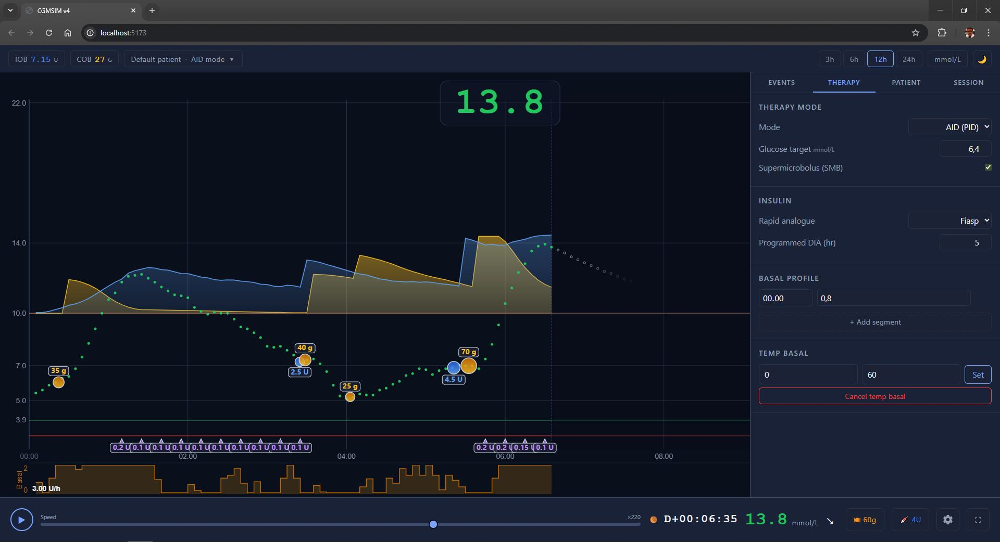

# CGMSIM v4

Standalone browser-based glycaemic teaching simulator for structured diabetes education sessions.

Part of the [CGMSIM platform](https://cgmsim.com) — fourth generation, designed for instructor-controlled classroom use with no server or installation required.



## Quick start

Download `cgmsim-v4-standalone.html` and open it in any modern browser (Chrome, Edge, Firefox, Safari). That's it — no server, no install, works offline. The whole simulator is one ~140 kB HTML file with all logic, styles, and assets inlined.

Sessions persist as JSON files you save to disk and reload at any time — full state including the chart history, event log, and RNG seeds, so a reloaded session resumes "as if nothing happened".

## Features

- Physiological glucose model with insulin PD profiles, carbohydrate absorption, EGP/dawn phenomenon, hypo counter-regulation, and Dexcom G6 sensor noise
- Three therapy modes: AID (PID controller with optional supermicroboluses), open-loop pump, MDI (with LIVE manual-entry and PRESCRIPTION auto-dispatch submodes)
- Two-layer parameter model — patient ground-truth physiology vs the controller's programmed beliefs — so mismatches between true and assumed ISF/ICR/DIA become teaching scenarios
- Adjustable simulation speed (×1 to ×3600) — run a full 14-day scenario in seconds
- Pause/resume at any point for discussion
- Side-by-side comparison runs to show "with vs. without" the latest decision
- AR2 forecast overlay (Nightscout-style 65-min projection)
- Big BG display chip floating on the chart, Nightscout-style
- Session save/load via JSON file (full state + chart history + event log)
- UI preferences (overlays, zoom, units, panel state) persist across reloads
- Dark and light themes; the light theme is tuned for projection in classrooms

## Development

```bash
npm install
npm run dev                 # Dev server with hot reload at localhost:5173
npm run build:standalone    # Produce the single-file HTML deliverable
npm run test                # Vitest physics tests
npm run typecheck           # tsc --build across all packages
```

Built with [Vite 8](https://vitejs.dev), [`vite-plugin-singlefile`](https://www.npmjs.com/package/vite-plugin-singlefile), and vanilla TypeScript. Requires Node.js 20.19+ or 22.12+.

See [BUILD.md](BUILD.md) for details on the monorepo layout and producing the standalone HTML.

## Disclaimer

CGMSIM v4 is a **teaching tool**. It generates only synthetic data and is not clinical software. It must not be used for treatment decisions of any kind.

## License

TBD
